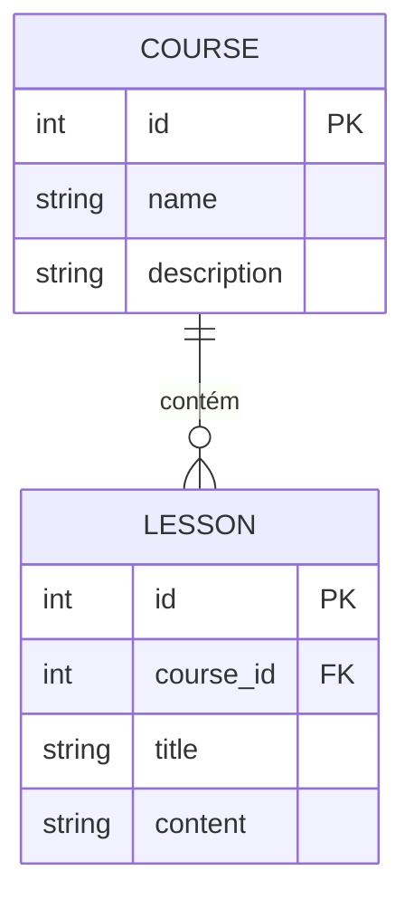

# Rocketseat Node API

Esta é uma API desenvolvida durante a Imersão MoviTalent, baseada em Node.js e TypeScript, utilizando o Drizzle ORM para manipulação de banco de dados e Docker para facilitar o ambiente de desenvolvimento.

## Tecnologias Utilizadas

- **Node.js**: Ambiente de execução JavaScript no servidor
- **TypeScript**: Superset do JavaScript que adiciona tipagem estática
- **Drizzle ORM**: ORM moderno para TypeScript/JavaScript
- **Docker**: Containerização do ambiente de desenvolvimento
- **Express** (ou Fastify, dependendo do seu setup): Framework para criação de APIs
- **SQLite** (ou outro banco, conforme configuração): Banco de dados relacional

## Estrutura do Projeto

```
├── docker-compose.yml         # Configuração de containers
├── drizzle.config.ts          # Configuração do Drizzle ORM
├── package.json               # Dependências e scripts
├── server.ts                  # Ponto de entrada da aplicação
├── src/
│   ├── database/
│   │   ├── client.ts          # Conexão com o banco de dados
│   │   └── schema.ts          # Definição dos esquemas/tabelas
│   └── routes/                # Rotas da API
│       └── get-course-by-id.test.ts # Testes automatizados
└── drizzle/
    ├── *.sql                  # Migrations
    └── meta/                  # Metadados do Drizzle
```

## Como rodar o projeto

1. Instale as dependências:
   ```bash
   npm install
   ```
2. Suba o ambiente com Docker (se aplicável):
   ```bash
   docker-compose up -d
   ```
3. Execute as migrations:
   ```bash
   npm run db:migrate
   ```
4. Inicie a aplicação:
   ```bash
   npm run dev
   ```

## Diagrama do Banco de Dados (Mermaid)



> **Obs:** O diagrama acima é um exemplo. Ajuste conforme o seu schema real.

## Scripts principais

- `npm run dev` — Inicia o servidor em modo desenvolvimento
- `npm run db:migrate` — Executa as migrations do banco
- `npm run db:studio` — Abre o Drizzle Studio para visualização do banco

## Testes

Os testes automatizados estão localizados em `src/routes/*.test.ts` e podem ser executados com:

```bash
npm test
```

---

Desenvolvido por Gustavo Nieri durante a Imersão MoviTalent 🚀
