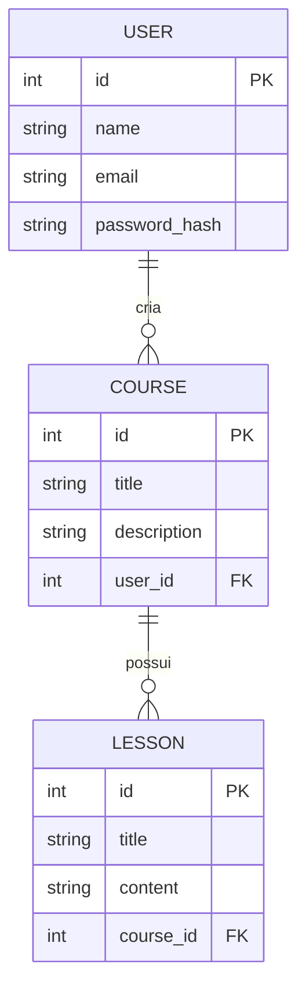

# Rocketseat Node API

API desenvolvida durante a Imersão MoviTalent, utilizando as melhores práticas do ecossistema Node.js moderno. O projeto é focado em performance, segurança e escalabilidade, com Fastify, PostgreSQL, Drizzle ORM, validação robusta e autenticação JWT.

## Tecnologias Utilizadas

- **Node.js** — Ambiente de execução JavaScript
- **TypeScript** — Tipagem estática para maior robustez
- **Fastify** — Framework web rápido e eficiente
- **PostgreSQL** — Banco de dados relacional
- **Drizzle ORM** — ORM moderno para TypeScript
- **Zod** — Validação de esquemas e dados
- **JWT (jsonwebtoken)** — Autenticação baseada em tokens
- **Vitest** — Testes automatizados rápidos e modernos
- **Scalar** — Documentação e visualização de banco de dados
- **Docker** — Containerização do ambiente
- **Docker Compose** — Orquestração de containers

## Funcionalidades da Aplicação

### Autenticação
- Registro de usuário (`POST /register`)
- Login de usuário e geração de JWT (`POST /login`)
- Middleware de autenticação para rotas protegidas

### Cursos
- Criar curso (`POST /courses`)
- Listar todos os cursos (`GET /courses`)
- Buscar curso por ID (`GET /courses/:id`)
- Atualizar curso (`PUT /courses/:id`)
- Deletar curso (`DELETE /courses/:id`)

### Aulas (Lessons)
- Criar aula vinculada a um curso (`POST /courses/:courseId/lessons`)
- Listar aulas de um curso (`GET /courses/:courseId/lessons`)
- Buscar aula por ID (`GET /lessons/:id`)
- Atualizar aula (`PUT /lessons/:id`)
- Deletar aula (`DELETE /lessons/:id`)

### Usuários
- Listar perfil do usuário autenticado (`GET /me`)

### Outros
- Documentação automática com Scalar
- Testes automatizados com Vitest

## Estrutura de Pastas

```
├── docker-compose.yml
├── Dockerfile
├── drizzle.config.ts
├── package.json
├── server.ts
├── tsconfig.json
├── src/
│   ├── database/
│   │   ├── client.ts
│   │   └── schema.ts
│   ├── routes/
│   │   ├── create-course.ts
│   │   ├── get-course-by-id.ts
│   │   └── ...
│   ├── middlewares/
│   ├── controllers/
│   └── utils/
└── tests/
```

## Diagrama do Banco de Dados (Mermaid)



## Como rodar o projeto

1. Clone o repositório e instale as dependências:
   ```bash
   npm install
   ```
2. Configure as variáveis de ambiente (`.env`), incluindo conexão com o PostgreSQL e segredo JWT.
3. Suba o ambiente com Docker:
   ```bash
   docker-compose up -d
   ```
4. Execute as migrations:
   ```bash
   npm run db:migrate
   ```
5. Inicie a aplicação:
   ```bash
   npm run dev
   ```
6. Acesse a documentação interativa via Scalar (URL informada no terminal).

## Testes

Execute os testes automatizados com:
```bash
npm run test
```

---

Desenvolvido por Gustavo Nieri durante a Imersão MoviTalent 🚀
